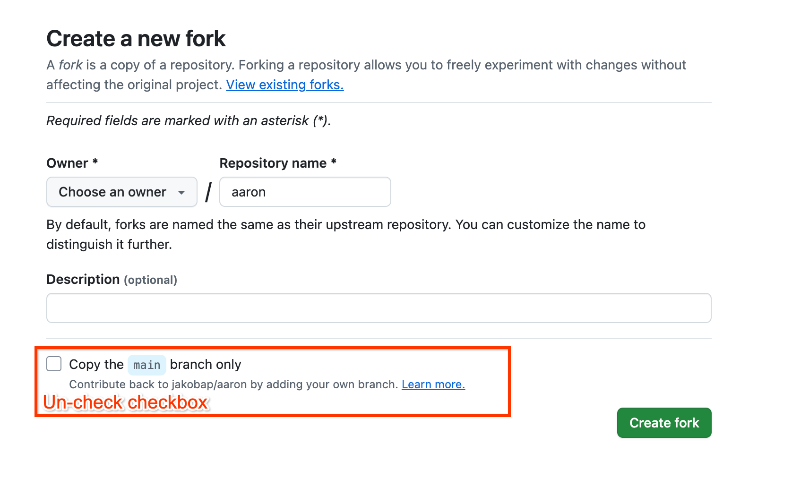

# Building Aaron the Intern, a Generative AI Challenge Lab 👩‍💻👨‍💻

Imagine you are the newest engineer at Google Cloud. Your task is helping your GCP customers make their tech work on GCP. You surely would love an intern to do the tedious technical research work for you...

Well, great that you live in the age of AI. So why not just building that intern yourself? Let's call "it": **"Aaron the intern"**.

This lab is designed to guide you through the complexity of GCP, Gemini, Firebase Genkit and more while building a real-world application. We'll be tackling a series of challenges, each building upon the last, to transform a basic Next.js application into a powerful AI-driven technical research tool.

Your end result will be an interactive, research agent that can take actions on a flexible knowledge base that you define.

Let's dive in!

## Getting Started with GCP 🚀

**1. Create or Select a GCP Project:**

Go to the [GCP Console](https://console.cloud.google.com/), login with your credentials, and select the project (top left) you have in your GCP environment.

**2. Fork the Workshop Content:**
*   Go to the [original repository page](https://github.com/jakobap/aaron) on GitHub and click the "Fork" button in the top-right corner.
*   On the fork creation page, **IMPORTANT:** Make sure to **uncheck** the box labeled "Copy the `main` branch only". This ensures you get all the necessary challenge branches.

*   Click "Create fork".

**3. Open Your Fork in IDX:**
*   Go to the main page of **your newly created fork** on GitHub.
*   Copy the HTTPS clone URL of your forked repository (e.g., `https://github.com/<YOUR_USERNAME>/aaron.git`).
*   [Open your fork in Firebase Studio:]("https://studio.firebase.google.com/import?url=)
<a href="https://studio.firebase.google.com/import?url=">
  <picture>
    <source
      media="(prefers-color-scheme: dark)"
      srcset="https://cdn.firebasestudio.dev/btn/open_dark_32.svg">
    <source
      media="(prefers-color-scheme: light)"
      srcset="https://cdn.firebasestudio.dev/btn/open_light_32.svg">
    
  </picture>
</a>

*   Paste your fork's URL into the "Import a repository" field and click "Import".

**4.(Alternative if not using Firebase Studio) Clone the fork into your editing environment :**
*   Alternatively, back in the Cloud Shell run `git clone <url of your forked repo>`.
*   You can run this challenge in any development environment. You must make sure that you're authenticated correclty though.

**5. Set up GCP Project and Application Default Credentials (ADC):**
Run the following commands to authenticate yourself and set your project as default in the console. The following commands should open a browser login flow. Follow this flow with your GCP account.
```bash
gcloud auth login
gcloud auth application-default login
gcloud config set project <YOUR_PROJECT_ID>
```

## Set Environment Variables:
**1. Env Vars in .env.local:**
-   Create a new file (in your project root) called `.env.local`. Fill it with a copy of the content in `.env.template`.
-   Fill out the project ID from your [Cloud Console](https://console.cloud.google.com/welcome).
-   The other env variables can stay empty for now. (By default you won't need the Gemini API key for now)

**2. Env Vars in terraform.tfvars:**
-   Find the file `terraform/terraform.tfvars` in your project root
-   Fill out the project ID just as you did in `.env.local`


## Deploy the required Infrastructure:
Deploy the required GCP Infrastructure by running the terraform script as follows:

```bash
cd terraform
terraform init
terraform plan
terraform apply
```

## Running the App
After completing the steps above you are able to run the app and access it on localhost with:
```bash
npm install
npm run dev
```

*Optionally, you can deploy the web app to Cloud Run by running `make all` in root.*

**Congratulations!** You've completed the basic GCP setup. You are now ready to explore the application and start the challenges!


# Workshop Challenge Mechanics

We've organized the workshop using **GitHub Branches** to keep things clear and manageable as you progress. Using branches allows you to work on the challenges step-by-step without affecting the completed solution available on the `main` branch.

*   **`main` Branch (Solution Branch):** This branch contains the base application **and the full solution!** You can explore the initial setup, run the app, and get familiar with the final codebase. You can always come back or compare your work to `main` to see the intended solution.

*   **`challenge` Branch (Your Workspace):** This single branch contains the starting point for all the challenges. You'll switch to this branch to work through the challenges sequentially. It includes the necessary base code and specific `ChallengeX.md` files (e.g., `Challenge1.md`, `Challenge2.md`, ...) in the root directory with instructions for each part of the workshop.

**To start the challenges, switch to the `challenge` branch using Git:**

```bash
git fetch origin
git checkout challenge
```

Now, look for the `Challenge1.md` file in the root directory and follow the instructions there. Once completed, move on to `Challenge2.md`, `Challenge3.md`, and so on.

**Don't worry about messing things up!** Since you are working on the `challenge` branch, you can experiment freely. The `main` branch remains untouched with the complete solution. If you ever want to start a challenge fresh or discard your changes, you can reset the `challenge` branch back to its original state using Git (e.g., `git reset --hard origin/challenge`), or simply compare your work against the `main` branch for reference.


# Your  Missions 🏋️‍♀️

Here is an overview of the challenges and the learnings they contain:


### Challenge 1: LLM Powered Data Mining 🕵️‍♀️

*   **Mission:**  Bring your text prompting to the next level.
*   **Learnings:**
    *   **Prompt Engineering for Extraction:** Crafting effective prompts to instruct the LLM to perform realiable entity extraction.
    *   **Prompt templating:** Organize your prompt templates with strongly typed input and output schemas.
*   **Key Technologies:** Next.js, Gemini API, Prompt Engineering, Genkit

### Challenge 2: Create Knowledge Base  📚

*   **Mission:**  Implement a custom indexing pipeline on GCP.
*   **Learnings:**
    *   **Chunking Strategies:**  Exploring different ways to divide text into chunks for optimal retrieval.
    *   **Embedding Creation:** Understanding how text embeddings are generated and their role in semantic search.
    *   **Embedding Storage:**  Learning about vector databases (in this case, Firestore is used for simplicity) for efficient storage and retrieval of embeddings.
*   **Key Technologies:** Next.js, Firestore, Genkit, Vertex AI embedding models, Chunking algorithms, Langchain Text Splitter.

### Challenge 3: Simple RAG 🤖

*   **Mission:**  Build a Basic RAG Q&A pipeline.
*   **Learnings:**
    *   **Simple RAG Pipeline:**  Understanding the core components of RAG: Retrieval (searching the knowledge base) and Generation (using an LLM to create answers).
    *   **Semantic Search:**  Using vector search to find relevant documents based on meaning, not just keywords.  The `VectorSearchUtil` is your search engine.
    *   **Prompt Engineering for Summarization:**  Crafting prompts to guide the LLM to generate concise and accurate summaries from retrieved documents.
*   **Key Technologies:** Next.js, Genkit retrievers, Gemini, Firestore Vector Search, Prompt Engineering.

### Challenge 4: Advanced RAG  📧

*   **Mission:**  Build an email generation pipeline based on an advanced RAG invocation chain.
*   **Learnings:**
    *   **Prompt Chaining with Langchain:**  Using Langchain's `RunnableSequence` to create complex, multi-step workflows.
    *   **Advanced RAG Techniques:**  Building a more sophisticated RAG system that involves task extraction, research, and email generation.
    *   **Prompt Engineering for Email Generation:**  Designing prompts to create emails that are not only informative but also professional and customer-friendly.
*   **Key Technologies:** Next.js, Firestore, Gemini API, Langchain, Vector Search, Prompt Chaining, Advanced Prompt Engineering.

### Challenge 5: Tracing & Tracking 🔭

*   **Mission:**  Observce and monitor your LLM calls.
*   **Learnings:**
    *   **Tracing and Tracking:**  Understanding the importance of observability in LLM applications.
    *   **Langfuse Integration:**  Using Langfuse to trace requests, monitor performance, and analyze results.
    *   **Quality Control & Experimentation:**  Using tracing data to identify areas for improvement and to evaluate the impact of changes (like prompt modifications).
*   **Key Technologies:** Next.js, Langfuse, Langchain, Observability principles.


# Get Ready to Explore! 🚀

Each challenge will have its own detailed `README.md` file within its branch, providing specific instructions and hints.

So, are you ready to build yoru own "Aaron the intern" and master the power of Generative AI on GCP? Let's get started!  Head over to `challenge-1` branch to begin your adventure! Good luck, and have fun! 🎉
